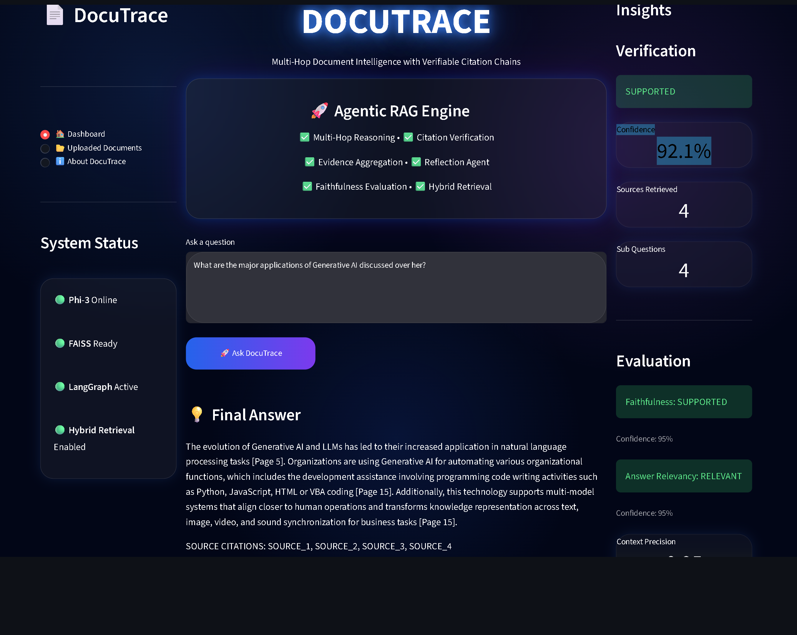
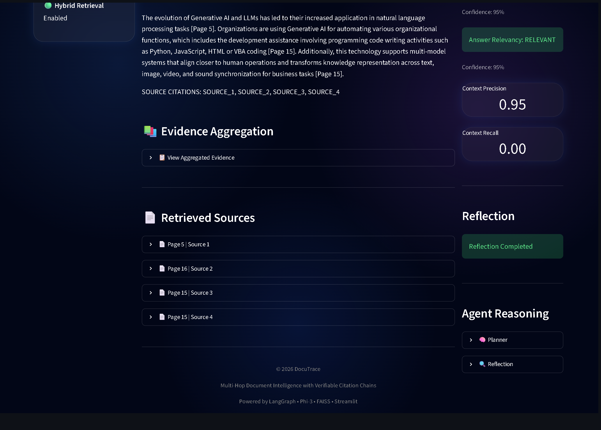
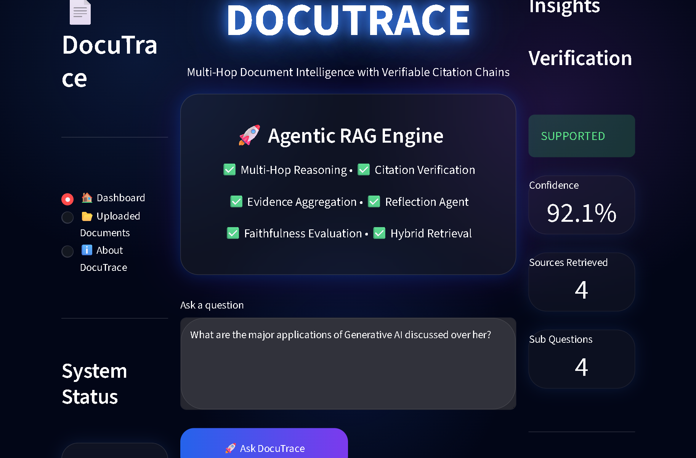
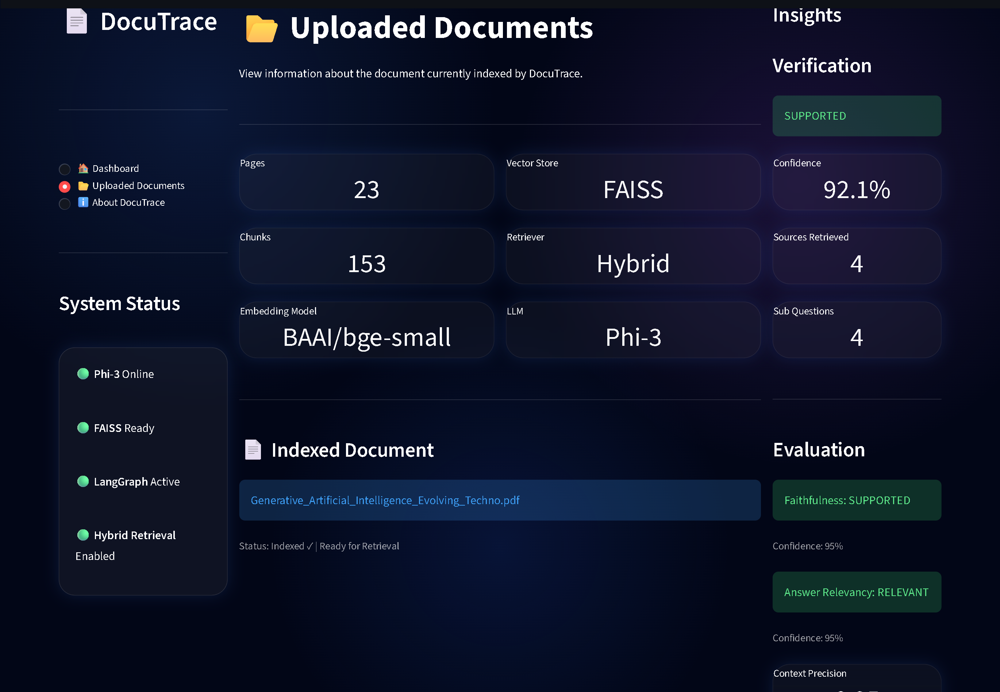
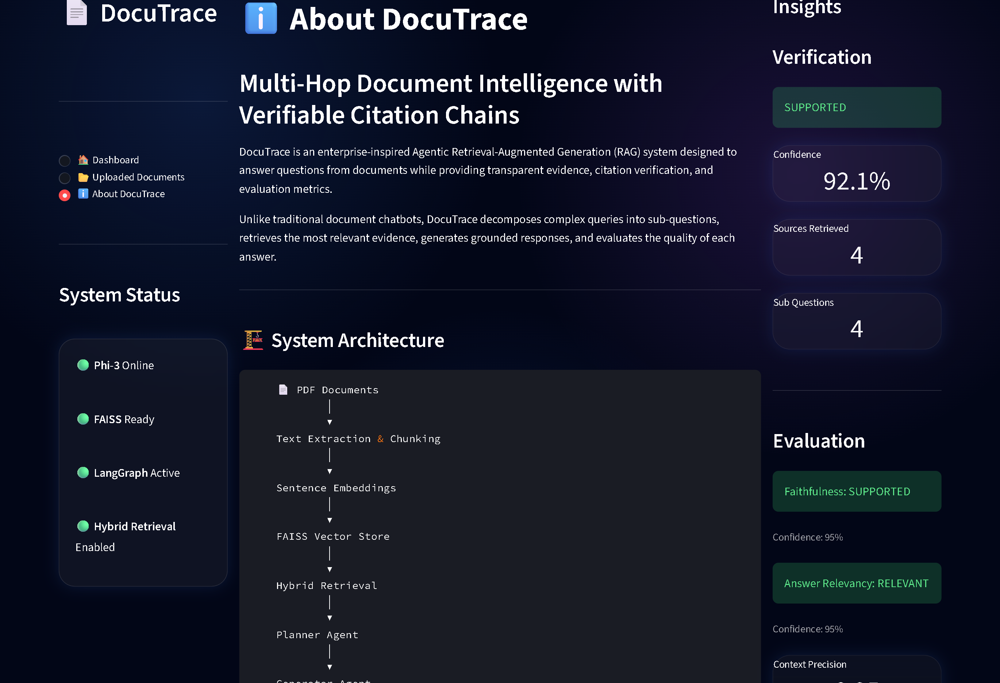

# 📄 DocuTrace

### Multi-Hop Document Intelligence with Verifiable Citation Chains

> **An enterprise-inspired Agentic Retrieval-Augmented Generation (RAG) system that answers questions from documents through multi-step reasoning, evidence aggregation, citation verification, and automated evaluation.**


---

## 📖 Overview

Large documents such as research papers, technical reports, legal documents, and business reports often contain valuable information that is difficult to locate quickly. Traditional document question-answering systems typically retrieve relevant text but provide limited transparency into how an answer was produced or whether it is supported by evidence.

**DocuTrace** is a document intelligence system that demonstrates how an Agentic RAG workflow can improve transparency and trustworthiness in document question answering.

Instead of relying on a single retrieval and generation step, DocuTrace uses a modular workflow that plans the query, retrieves relevant evidence, generates an answer grounded in the retrieved context, performs answer reflection, verifies the response, and reports evaluation metrics to help users assess answer quality.

The system also provides an interactive Streamlit dashboard where users can explore retrieved evidence, inspect supporting sources, review evaluation metrics, and understand the reasoning process behind generated responses.

---

## ⭐ Why DocuTrace?

DocuTrace was developed to explore how modern Retrieval-Augmented Generation (RAG) systems can produce answers that are not only relevant but also transparent and verifiable.

The project focuses on:

* Improving transparency through evidence-grounded responses.
* Demonstrating a modular multi-agent workflow using LangGraph.
* Providing citation-aware document question answering.
* Evaluating answer quality using faithfulness, answer relevancy, context precision, and context recall.
* Presenting the complete reasoning pipeline through an interactive dashboard.


---

# ✨ Key Features

## 🤖 Agentic RAG Workflow

* Multi-agent workflow orchestrated using **LangGraph**.
* Query decomposition through a dedicated **Planner Agent**.
* Answer generation using a local **Phi-3** Large Language Model via **Ollama**.
* Reflection stage for answer refinement before final verification.

## 🔍 Retrieval & Evidence

* Hybrid retrieval pipeline combining semantic retrieval with keyword-based retrieval.
* FAISS vector database for efficient similarity search.
* Evidence aggregation from retrieved document chunks.
* Source-aware responses with document citations.

## 📊 Evaluation & Verification

* Automated answer verification.
* Faithfulness evaluation.
* Answer relevancy evaluation.
* Context Precision and Context Recall metrics.
* Transparent reasoning and evaluation dashboard.

## 🖥️ Interactive Dashboard

* Modern Streamlit interface with modular architecture.
* Interactive Insights Panel.
* Evidence Aggregation Viewer.
* Retrieved Sources Explorer.
* Documents Information Page.
* About Project Page.

---

## 📦 Current Release

**Version:** `v1.0`

### Implemented

- ✅ Modular Streamlit Dashboard
- ✅ Multi-Agent LangGraph Workflow
- ✅ Hybrid Retrieval Pipeline
- ✅ Evidence Aggregation
- ✅ Citation Verification
- ✅ Reflection-based Answer Refinement
- ✅ Faithfulness & Relevancy Evaluation
- ✅ Interactive Insights Panel


---

# 🏗️ System Architecture

DocuTrace follows a modular Agentic Retrieval-Augmented Generation (RAG) architecture where each stage of the pipeline is responsible for a specific task. Instead of directly generating responses from retrieved text, the workflow separates planning, retrieval, generation, reflection, verification, and evaluation into independent components.

```text
                     User Query
                          │
                          ▼
                  Planner Agent
                          │
                          ▼
              Hybrid Retrieval Pipeline
             (Semantic + Keyword Search)
                          │
                          ▼
               Evidence Aggregation
                          │
                          ▼
                 Generator Agent
                   (Phi-3 via Ollama)
                          │
                          ▼
                 Reflection Agent
                          │
                          ▼
              Citation Verification
                          │
                          ▼
             Evaluation Pipeline
      • Faithfulness
      • Answer Relevancy
      • Context Precision
      • Context Recall
                          │
                          ▼
                Final Response
                          │
                          ▼
            Interactive Streamlit UI
```

### Workflow Components

| Component             | Responsibility                                                                                                   |
| --------------------- | ---------------------------------------------------------------------------------------------------------------- |
| Planner Agent         | Analyzes the user query and prepares the reasoning workflow.                                                     |
| Hybrid Retrieval      | Retrieves the most relevant document chunks using semantic and keyword-based retrieval.                          |
| Evidence Aggregation  | Combines retrieved context into a unified evidence set.                                                          |
| Generator Agent       | Generates an answer grounded in the retrieved evidence using Phi-3.                                              |
| Reflection Agent      | Reviews the generated answer before verification.                                                                |
| Citation Verification | Ensures citations correspond to retrieved evidence.                                                              |
| Evaluation Pipeline   | Computes answer quality metrics including faithfulness, answer relevancy, context precision, and context recall. |
| Streamlit Dashboard   | Presents answers, evidence, evaluation metrics, and retrieved sources through an interactive interface.          |


---

# 🛠️ Tech Stack

| Category                       | Technologies                    |
| ------------------------------ | ------------------------------- |
| **Programming Language**       | Python                          |
| **Frontend**                   | Streamlit, Custom CSS           |
| **AI Orchestration**           | LangGraph                       |
| **RAG Framework**              | LangChain                       |
| **Large Language Model (LLM)** | Phi-3 (via Ollama)              |
| **Embeddings**                 | Sentence Transformers           |
| **Vector Database**            | FAISS                           |
| **Retrieval**                  | Hybrid Retrieval (FAISS + BM25) |
| **Document Processing**        | PyMuPDF                         |
| **Model Hub**                  | Hugging Face Hub                |
| **Evaluation**                 | DeepEval                        |
| **Machine Learning**           | Scikit-learn                    |
| **Development Environment**    | Visual Studio Code              |


---

# 📂 Project Structure

```text
DocuTrace/
│
├── app/
│   ├── agents/              # LangGraph workflow nodes
│   ├── evaluation/          # Faithfulness & relevancy evaluation
│   ├── ingestion/           # Document loading & preprocessing
│   ├── ml/                  # Embeddings & ML utilities
│   ├── rag/                 # RAG pipeline
│   ├── retrieval/           # Hybrid Retrieval & reranking
│   ├── services/            # Backend service layer
│   └── verification/        # Citation verification
│
├── data/                    # Source documents & vector database
│
├── frontend/
│   ├── assets/              # Images & static assets
│   ├── components/          # Dashboard components
│   ├── pages/               # About & Documents pages
│   ├── main.py              # Streamlit entry point
│   ├── run_frontend.py
│   └── styles.py
│
├── requirements.txt
├── README.md
├── .gitignore
└── LICENSE (Planned)
```

---

## 📖 Directory Overview

| Directory         | Description                                                                  |
| ----------------- | ---------------------------------------------------------------------------- |
| **app/**          | Core backend implementation of the Agentic RAG workflow.                     |
| **agents/**       | Planner, Generator, Reflection and other workflow nodes.                     |
| **retrieval/**    | Hybrid Retrieval pipeline, reranking and evidence retrieval.                 |
| **evaluation/**   | Computes answer quality metrics such as Faithfulness and Answer Relevancy.   |
| **verification/** | Citation verification and evidence validation.                               |
| **services/**     | Connects the frontend with the backend pipeline.                             |
| **frontend/**     | Interactive Streamlit application.                                           |
| **components/**   | Modular UI components including Sidebar, Dashboard and Insights Panel.       |
| **pages/**        | Additional application pages such as Uploaded Documents and About DocuTrace. |
| **data/**         | Stores source documents and generated vector indexes.                        |


---

# 📸 User Interface

## 🏠 Dashboard

The main dashboard allows users to submit document-related queries and interact with the Agentic RAG pipeline through a modern Streamlit interface.

<p align="center">
  
</p>

---

## 💡 Final Answer & Evidence

The generated answer is presented together with evidence aggregation and retrieved document sources to improve transparency and traceability.

<p align="center">
  
</p>

---

## 📊 Insights Panel

The Insights panel provides verification status, confidence score, evaluation metrics, reflection results, and planner outputs.

<p align="center">
  
</p>

---

## 📂 Documents

Displays information about the indexed document, embedding model, vector database, and retrieval pipeline.

<p align="center">
  
</p>

---

## ℹ️ About DocuTrace

Summarizes the project architecture, technology stack, and system workflow.

<p align="center">
  
</p>


---

# 🚀 Installation

## 1. Clone the Repository

```bash
git clone https://github.com/Pooja-314/DocuTrace.git
cd DocuTrace
```

## 2. Create a Virtual Environment

### Windows

```bash
python -m venv venv
venv\Scripts\activate
```

### macOS / Linux

```bash
python3 -m venv venv
source venv/bin/activate
```

## 3. Install Dependencies

```bash
pip install -r requirements.txt
```

## 4. Configure Environment Variables

Create a `.env` file in the project root and add the required environment variables.

> **Note:** The `.env` file is intentionally excluded from the repository for security reasons.

## 5. Install an Ollama Model

DocuTrace uses **Phi-3** as the default Large Language Model.

```bash
ollama pull phi3
```

> **Note:** The default model is configured as:

```python
MODEL_NAME = "phi3"
```

You can replace `phi3` with any other Ollama-compatible model by updating the `MODEL_NAME` variable in the project configuration.
```

## 6. Launch the Application

```bash
cd frontend
streamlit run main.py
```

## 7. Verify the Setup

Once the application starts successfully, open:

```text
http://localhost:8501
```

You should see the **DocuTrace Dashboard**, where you can:

- Ask questions about indexed documents.
- View retrieved evidence and citations.
- Explore the Insights panel.
- Review evaluation metrics.


---

# ▶️ Usage

After successfully launching the application, open the Streamlit interface in your browser:

```text
http://localhost:8501
```

### Step 1 — Launch DocuTrace

Start the Streamlit application:

```bash
cd frontend
streamlit run main.py
```

---

### Step 2 — Ask a Question

Navigate to the **Dashboard** and enter a question related to the indexed document.

**Example Questions**

```text
What are the major applications of Generative AI?

Summarize the document.

Explain the role of cloud computing.

What challenges are discussed in the document?
```

---

### Step 3 — Review the Generated Answer

DocuTrace generates an evidence-grounded answer using the Agentic RAG pipeline.

The response includes:

- Final Answer
- Source Citations
- Evidence Aggregation
- Retrieved Sources

---

### Step 4 — Inspect the Insights Panel

The Insights panel provides additional information about the generated response, including:

- Verification Status
- Confidence Score
- Number of Retrieved Sources
- Planner-generated Sub-Questions
- Reflection Output
- Faithfulness Evaluation
- Answer Relevancy
- Context Precision
- Context Recall

---

### Step 5 — Explore Additional Pages

The application also includes:

- 📂 **Uploaded Documents**
  - View document statistics
  - Embedding model
  - Vector database
  - Retrieval pipeline

- ℹ️ **About DocuTrace**
  - Project overview
  - System architecture
  - Technology stack
  - Key features

  ---

# 📊 Evaluation

DocuTrace evaluates generated responses to help users assess answer quality and transparency. Instead of only generating an answer, the system also reports evaluation metrics that indicate how well the response is supported by the retrieved evidence.

| Metric | Description |
|---------|-------------|
| **Faithfulness** | Measures whether the generated answer is grounded in the retrieved document context. |
| **Answer Relevancy** | Evaluates how well the generated response answers the user's question. |
| **Context Precision** | Indicates how much of the retrieved context is relevant to the generated answer. |
| **Context Recall** | Measures whether the retrieved context contains sufficient information to answer the question. |
| **Citation Verification** | Verifies that citations correspond to the retrieved document evidence. |

### Evaluation Dashboard

The evaluation results are displayed in the **Insights Panel**, allowing users to inspect:

- ✅ Verification Status
- 📈 Confidence Score
- 📊 Faithfulness
- 📊 Answer Relevancy
- 📊 Context Precision
- 📊 Context Recall
- 🧠 Reflection Output